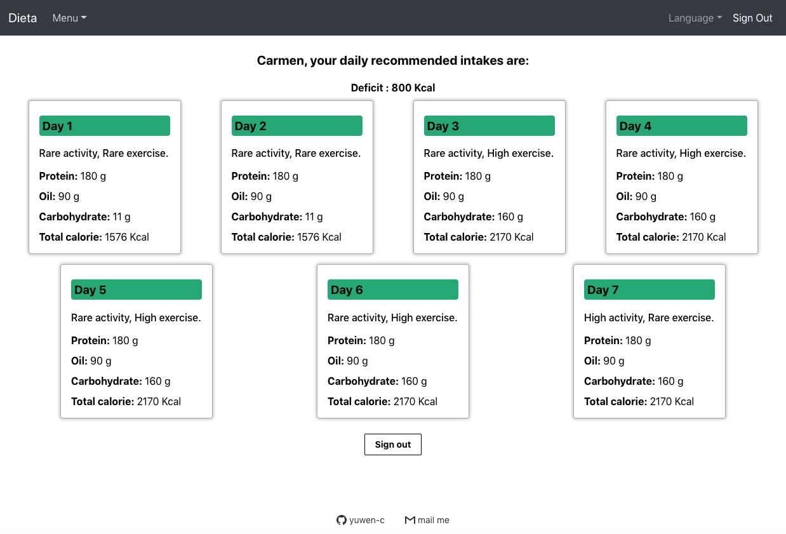

# Dieta
### Help you to calculate calories during your diet!! 

<h2 align="center">
  
   
</h2>

## for people who...
- Don't know how many calories should you eat to lose weight.
- What if I go to gym today or go for a walk? 
- Don't know if I'm losing weight too fast or too slow and how to do a calorie adjustment.

## features

## How to use?
- TRY It!! then if you like it, sign up.
- For first time user:
  - go to "Start Diet" page.
  - fill in your weight, how fast you want to lose your weight.
  - then follow the intruction to choose your activity amount and exercise amount each day.
- then we'll give you a list of nutritions.
- For a second time user:
  - after a week diet, your want to know if the rate is OK, so go to "During diet" page.
