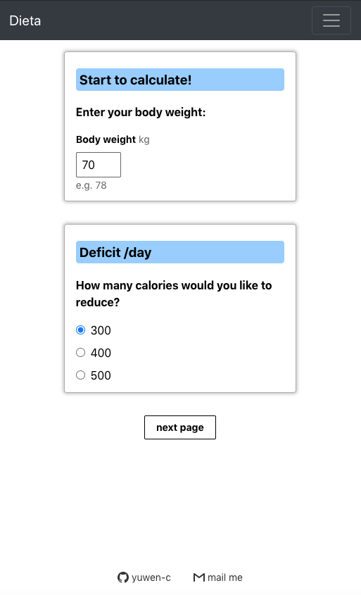

# Dieta
### Help you to calculate calories during your diet!! 🍱

<h2 align="center">
  
   
</h2>

## for people who...💡

- Don't know how many calories should you eat to lose weight.
- What if I go to gym today or go for a walk? 
- Don't know if I'm losing weight too fast or too slow and how to do a calorie adjustment.

## features

✨ Modern UI for both mobile and desktop\
✨ Built by React.js\
✨ Styled with Tachyons\
✨ Responsive form using react-super-responsive-table\
✨ Responsive navigation bar using react-bootstrap\
✨ Backend built with node.js, express.js\
✨ Using RestfulAPI\
✨ Internationalize with Chinese and English using react-i18next\
✨ Saving user data in PostgreSQL\
✨ Password hashed by Bcrypt\
✨ Front-end deployed to Netlify\
✨ Back-end deployed to Heroku

## How to use? 

**🎯 TRY It!! Then if you like it, sign up.**
- For first time user:
  - go to "Start Diet" page.
  - fill in your weight, how fast you want to lose your weight.
  - then follow the intruction to choose your activity amount and exercise amount each day.

<h2 align="center">
  
   
</h2>

- then we'll give you a list of nutritions for this week.
- For a second time user:
  - after a week with diet, your want to know if the rate is OK, so go to "During diet" page.
  - fill in the average weight of this week and last week to get an advice.
  - base the advice and evaluate your personal situation to decide the speed of next week, make an adjustment to the next week deficit.
  - then do the activity and exercise options again. this time instead of choosing one by one, you can load the record of last week, and do some changes.
  - get the result of this week.
  - you can always check your last record of nutrition by going to "Latest result" page.

<h2 align="center"  style="background-color: coral;">
  
   
</h2>
