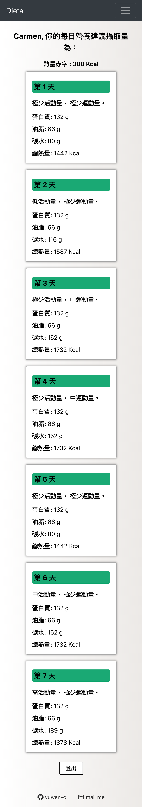

# Dieta
## Help you to calculate calories during the diet!! 🍱
## 🔆 [see live](https://yuwen-dieta.netlify.app) 
## [中文版readme](https://github.com/yuwen-c/dieta/blob/master/README_Mandarin.md)
## backend server goes [here](https://github.com/yuwen-c/dieta-api)

## I built this because...💡
- I was in dieta and needed to calculate calorie every week, for about 15 weeks in total.
- There were so many repetitions in it, so I decided to build a system so that next time I'll go though the diet with less effort.
- I also recommended this project to my coach, hope this project can help more people! 🥰

## Routes and user guide

  
   

- There are 3 main routes (yellow square in picture) in Dieta:
1. The first week, "Start Diet": user fills in weight, deficit, and select strength level of activity, exercise based on the table and gets the result of calorie and nutrition. 
2. From the second week, "During Diet": fill in average weight of this and last week and modify the deficit depends on the suggestion and your circumstances. Then fill in the activity and exercise part like the first week, and get your result.
3. "Latest Result": get your last result anytime with this route.

## Success 🚀
- I sent Dieta to my coach, she found that it was pretty good and also recommended to her students 🥰 .
- Dieta have got **31** users in a month.
＝＝＝＝
## features
✨ **Modern UI** for both mobile and desktop\
✨ Built by **React.js**\
✨ Styled with **Tachyons**\
✨ Responsive form using **react-super-responsive-table**\
✨ Responsive navigation bar using **react-bootstrap**\
✨ Backend built with **node.js**, **express.js**\
✨ Using **RestfulAPI**\
✨ Internationalize with Chinese and English using **react-i18next** and **hooks**\
✨ Saving user data in **PostgreSQL**\
✨ Password hashed by **Bcrypt**\
✨ Front-end deployed to **Netlify**\
✨ Back-end deployed to **Heroku**

## How to use? 

**🎯 TRY It!! Then if you like it, sign up.**\
☝ For first time user:
- go to "Start Diet" page.
- fill in your weight and how fast you want to lose your weight.

  
   

- then follow the intruction to choose your activity amount and exercise amount each day.

  
   

- then we'll give you a list of nutritions for this week.

  
   

✌ For a second time user:
- after a week with diet, your want to know if the rate is OK, so go to "During diet" page.
- fill in the average weight of this week and last week to get an advice.
- base the advice and evaluate your personal situation to decide the speed of next week, make an adjustment to the next week deficit.

  
   

- then do the activity and exercise options again. this time instead of choosing one by one, you can load the record of last week, and do some changes.
- get the result of this week.
- you can always check your last record of nutrition by going to "Latest result" page.

