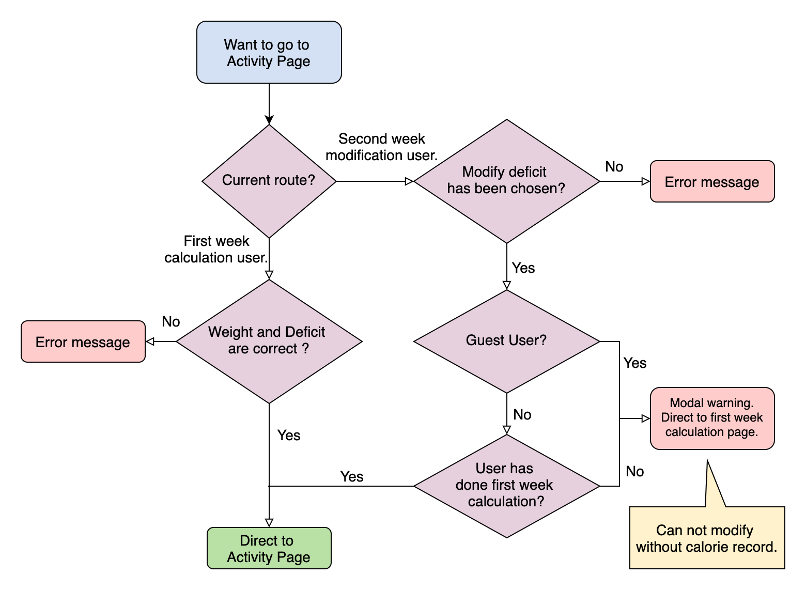

# Dieta
## Help you to calculate calories during the diet!! 🍱
## 🔆 [see live](https://yuwen-dieta.netlify.app) 
## [中文版readme](https://github.com/yuwen-c/dieta/blob/master/README_Mandarin.md)
## backend server goes [here](https://github.com/yuwen-c/dieta-api)


## I built this because...💡
- I was in dieta and needed to calculate calorie every week, for about 15 weeks in total.
- There were so many repetitions in it, so I decided to build a system so that next time I'll go though the diet with less effort.
- I also recommended this project to my coach, hope this project can help more people! 🥰


## Routes and user guide

<div align="center">
  
  <br>
</div>

- There are 3 main routes (yellow square in picture) in Dieta:
1. The first week, "Start Diet": user fills in weight, deficit, and select strength level of activity, exercise based on the table and gets the result of calorie and nutrition. 
2. From the second week, "During Diet": fill in average weight of this and last week and modify the deficit depends on the suggestion and your circumstances. Then fill in the activity and exercise part like the first week, and get your result.
3. "Last Result": get your last result anytime with this route.


## Success 🚀
- I sent Dieta to my coach, she found that it was pretty good and also recommended to her students 🥰 .
- Dieta have got **31** users in a month.

## Features

### Structures
✨ Front-end website with **React.js**.\
－Based on Javascript. A project built with small components which can be reused.\
✨ Back-end server with **node.js**, **express.js**.\
－Using Javascript. Powerful, can be built fast.\
✨ Connect front-end and backend with **RestfulAPI**.\
－more readable, easy to debug. The seperated endpoint can be combined into multiple logic.\
✨ User data stored in **PostgreSQL**.\
✨ Combine data base with server using **knex**.\
－Powerful, good documentation. 

### Responsive website
✨ Works well in both mobile and desktop.\
✨ Responsive tables using ```react-super-responsive-table```.\
✨ Responsive nav bar using ```react-bootstrap```.\
✨ Different layouts fitting for both mobile and desktop using ```Tachyons```.

### Security
✨ Hash users' password with **Bcrypt**.\
✨ User password hashes are stored seperatly from other data in different tables to reduce the probability of exposing user password.

### Internationalization, i18n
✨ English and Mandarin version is provided using ```react-i18next``` and ```hooks```\
－Minimize project size by locating translation files on back-end.
－Detecting user language automatically.
－Based on i18next which works well with many frontend-frameworks.

### Deployment
✨ Front-end website deploying to **Netlify**.\
－ Perfectly for frond-end website, response immediately without waiting to be awakened.
✨ Back-end server deploying to **Heroku**. \
－Easy to maintain and operate. Suitable for traffical level of an non-produce website.


## Preview
- First time user, "Start Diet", fill in weight and deficit.

<div align="center">
  
  <br>
</div>

- Follow the table, select strength level of activity of this week.
<div align="center">
  
  <br>
</div>

- Calculation result on desktop with user name, nutrition and calorie.
<div align="center">
  
  <br>
</div>

- Second week user, "Duting Diet", fill in the average weight of this and last week. A suggestion will show up dynamically. Then decide your deficit next week.
<div align="center">
  
  <br>
</div>


## How was Dieta built?

### Registration, sign in, guest-user login
- How does data flow during these processes?
  
<div align="center">
  
  <br>
</div>

- Sign in (yellow squares): pass data to database, compare hashes, then return data to front-end.
- Registration (blue squares): pass data to backend, create a new user and store hash into Login table. Also, create a new data into Users table. The two steps are finished in one **transaction**. Return data to front-end.
- Guest User (light-purple squares): skip the registration step, do calculation directly. After that, route to registration page (arrow points registration blue square)。Then, create a new user, and store his data to all tables (see scripts with purple background).


### Route 1: "Start Diet", calculate and store calorie
- Flow chart of "Start Diet":

<div align="center">
  
  <br>
</div>
- save all the fill-in data to state, then store to database via server at the end.

### Route 2: "During Diet", after the second week, modify the dificit

- "During Diet"，a suggestion will show up after user entering weight. Then user can change deficit. See the flow chart and the state change:

<div align="center">
  
  <br>
</div>

- After entering weight, get the loosing rate and trigger state change to show a specific suggestion.
- User chooses to speed up or slow down, options will change respectively.

#### Demo：
1. Fill in weight, a suggestion will show up.
2. Select speed up or slow down, the options will change.

<div align="center">
  
  <br>
</div>


### Download activity and exercise record of last week. 
- After the second week, users can download records of activity and exercise of last week. See flow chart, state change below:

<div align="center">
  
  <br>
</div>

- We already had states to save activity and exercise. (Array with 7 elements which stands for 7 days)
- To get record and show on the screen, a "checked" state is added. There are 4 levels each day: "Rare, Low, Medium, High". To represent it, we use a two-dimentional array, each elements contains 4 booleans to stands for 4 levels. A ```[false, true, false, false]``` means "Low" is chosen.


### Route 3: "Last Result"
- Get last result and show on the screen.

<div align="center">
  
  <br>
</div>

- In this route we have to check if it's a guest user, and also, if there is record of this user (an registered user without calculation won't have record).
- Showing record if there is one. Showing a reminder if not, and direct user to route 1: "Start Diet".

### Check authority before entering the 3 routes (Start Diet, During Diet, Last result).
- Check if it's a loggin user. Some pages are limited for loggin user, users without logging will direct to sign in page.
- Also, some pre-processing such as deleting, fetching, will be executed during this stage.

<div align="center">
  
  <br>
</div>


### Check before next page
- When user clicks next page button, review the blankets, format, then go to next page.
- Define each check with ```switch case```.
- Take "entering selection of activity level page" as an example:
  
<div align="center">
  
  <br>
</div>

- When user goes to activity level page, do check:
1. where does the user come from? Route 1 "Start Diet", or Route 2 "During Diet"?
2. If the current page is finished correctly. If not, show reminder. 
3. If correct, users from Route 1, direct to activity page. Users from Route 2, check if there is stored result. If not, pop up an modal.
 
### Render different screens according to routes

- Use function and state to controll rendering in ```App.js```: 

<div align="center">
  
  <br>
</div>

- 3 functions and 1 route state are set.
- ```A function```: change State。
- ```B function```: pass route state in it, and return components correspondingly. Define by ```switch case```.
- ```C render function```: put the execution result of ```B function```.

### Pop up modal with portal
- See flow chart with data passing by **portal** below:

<div align="center">
  
  <br>
</div>

- A user without records (without finishing first time calculation) want to download his record. Pop up a modal of "No calorie record" or "No activity or exercise record".
- Set modal component and context component seperately. Pass content to modal as children so that the modal component is reusable.


### Bilingual by react-i18next 

<div align="center">
  
  <br>
</div>

- Set the ```i18n.js``` file with language, detector, load path. Import it to ```index.js``` to get bundled.
- Put translation files in ```public``` > ```locales``` folder.
- Several ways to use react-i18next:
1. Toggle language change in nav bar using useTranslation Hook.
2. functional component using useTranslation Hook.
3. class component using withTranslation, a Higher order component.
- Besides, the data in activity and exercise tables is not written in it, instead, it's imported. So the translation is stored in another folder, after detecting language, we load it from there.


