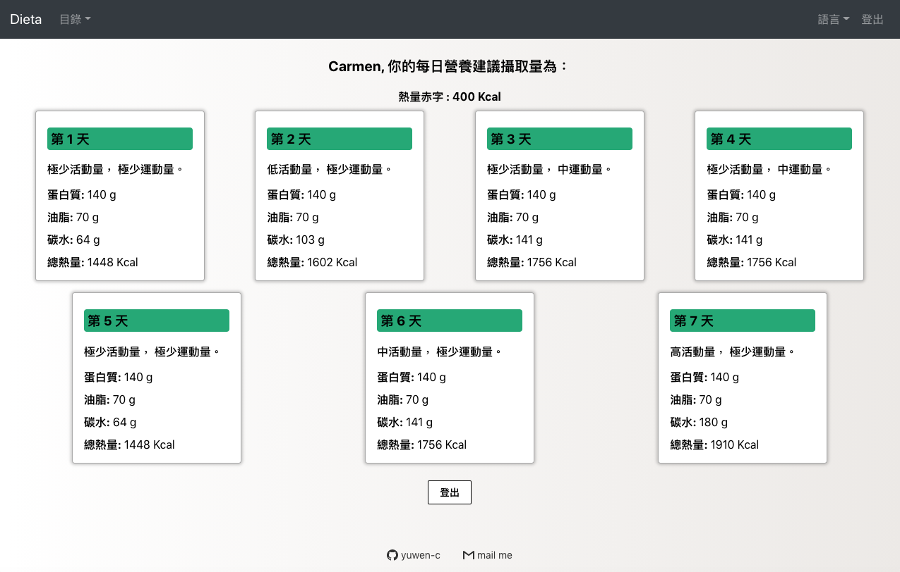

# Dieta
### Help you to calculate calories during your diet!! 

<h2 align="center">
  
   
</h2>

## for people who...
- Don't know how many calories should you eat to lose weight.
- What if I go to gym today or go for a walk? 
- Don't know if I'm losing weight too fast or too slow and how to do a calorie adjustment.

## features
Modern UI for both mobile and desktop/
利用React.js框架設計的適合手機/ 桌機的前端網站，搭配Express Server，利用RestfulAPI完成前後端相連。/
使用者資料如姓名、加密的密碼、體重，都儲存在PostgreSQL資料庫。/
前端網站部署到Netlify，後端Server及資料庫部署到Heroku。/
使用react-i18next使網站可切換中/英文。/

## How to use?
- TRY It!! Then if you like it, sign up.
- For first time user:
  - go to "Start Diet" page.
  - fill in your weight, how fast you want to lose your weight.
  - then follow the intruction to choose your activity amount and exercise amount each day.
- then we'll give you a list of nutritions for this week.
- For a second time user:
  - after a week with diet, your want to know if the rate is OK, so go to "During diet" page.
  - fill in the average weight of this week and last week to get an advice.
  - base the advice and evaluate your personal situation to decide the speed of next week, make an adjustment to the next week deficit.
  - then do the activity and exercise options again. this time instead of choosing one by one, you can load the record of last week, and do some changes.
  - get the result of this week.
  - you can always check your last record of nutrition by going to "Latest result" page.

