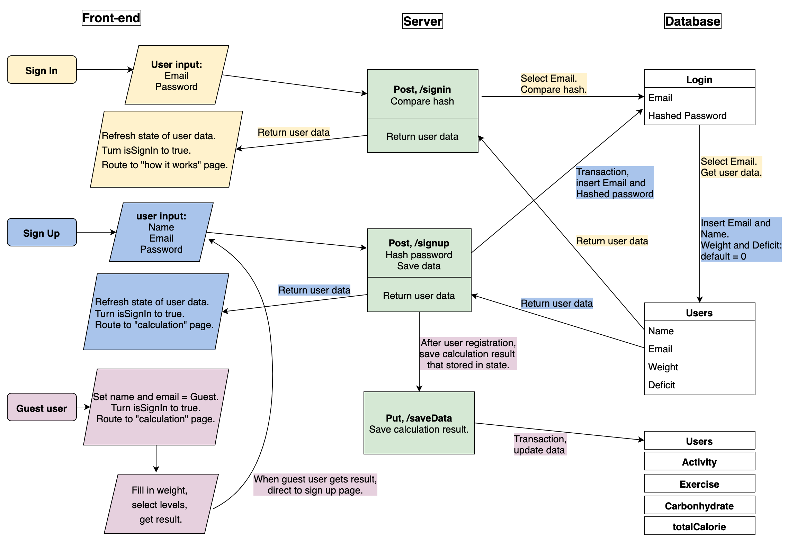
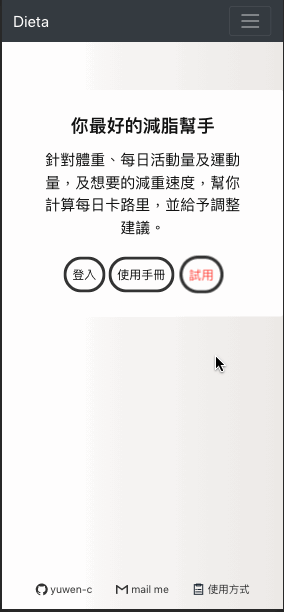
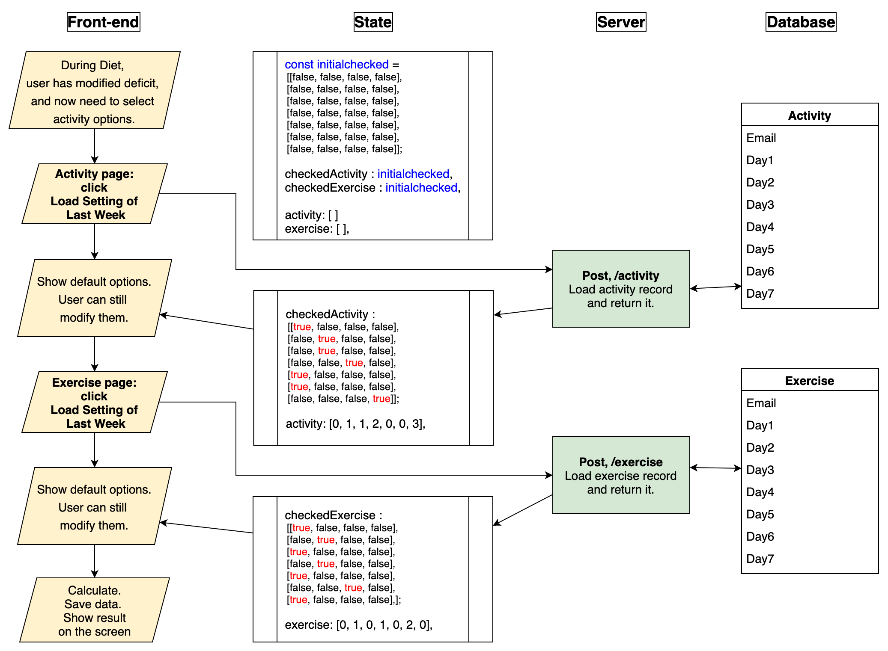
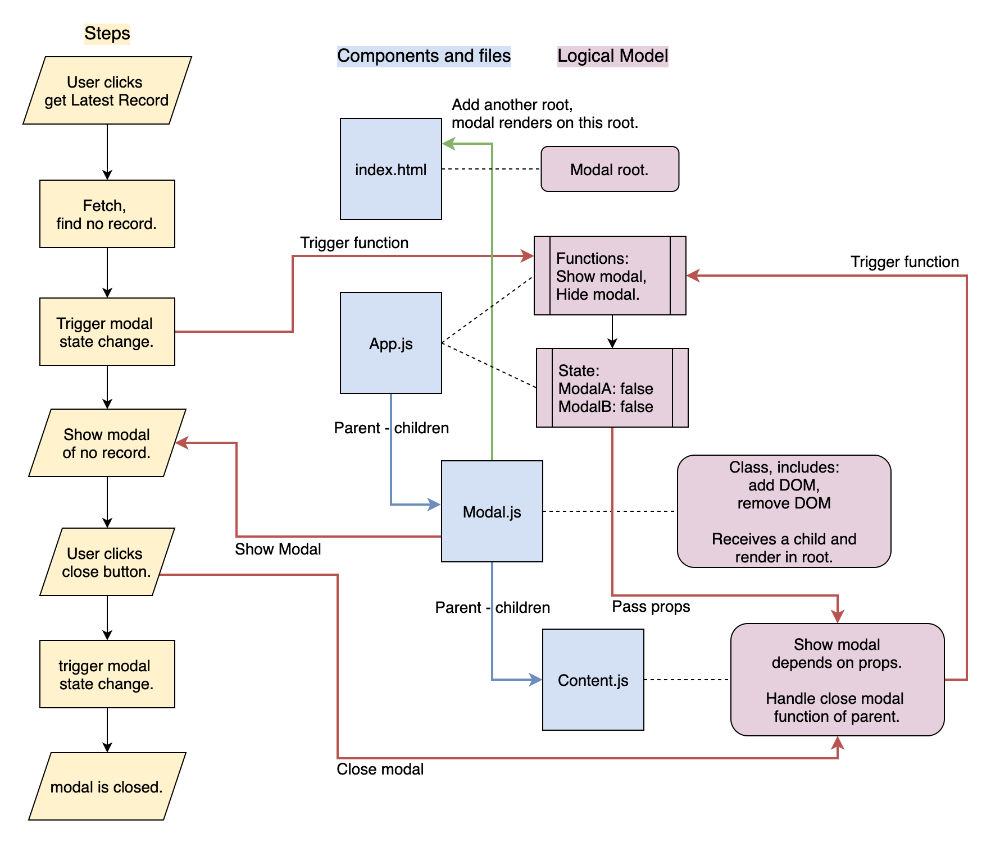

# Dieta - 減重熱量計算系統
### 🔆 [實際操作網站](https://yuwen-dieta.netlify.app/)
### [readme in English](https://github.com/yuwen-c/dieta/blob/master/README.md)
### [後端server的github](https://github.com/yuwen-c/dieta-api)


## 動機及目的
- 想減重😁。採用的方式是：讓「攝取」的熱量比「消耗」的熱量少。
- 減重期間共約15週，每週都要重複計算熱量、做調整，我希望有一個系統，不只幫我算，也記得上週的數據，方便我調整，讓我減重更輕鬆。

## 路徑簡介、使用方式介紹

<div align="center">
  
  <br>
</div>

- Dieta 主要有3條路徑/ 功能 (圖中黃色方框)：
1. 第一週，開始減脂：使用者輸入體重、預計熱量赤字，並且根據指示，選擇活動量、運動量等級，得到營養素及熱量的計算結果。
2. 第二週以後：輸入本週、上週平均體重，獲得建議，來決定下一週的調整方向(少吃或多吃)，然後一樣填入活動量、運動量，得到熱量計算結果。
3. 此外，隨時可以到「結果查詢」叫出上次的計算結果。


## 成果？？？？？🚀
- 我把這個project推薦給我的教練，他也鼓勵他的學生使用🥰。
- 上線一個月內達到xx個使用者。

## 特點

### 整體架構
✨ 前端網站使用**React.js**\
－語法類似Javascript，利用多個元件組合而成，元件各自獨立且可重複使用。\
✨ 後端server利用**node.js**, **express.js**\
－使用Javascript語言，效能強大，可快速建造一個server。
✨ 前後端以**RestfulAPI**連接。\
－提高可讀性、除錯效率，分離每個端點，可彈性組合成多種邏輯。\
✨ 使用者資料儲存於**PostgreSQL**資料庫。\
✨ 資料庫與server以**knex**相接。

### 響應式網站
✨ 手機、桌機體驗良好的前端網站。\
✨ 利用```react-super-responsive-table```達成響應式表格。\
✨ 利用```react-bootstrap```達成響應式導覽列。\
✨ 利用Tachyons設定達成：針對不同螢幕大小，顯示不同樣式的設計。

### 安全性
✨ 使用者密碼以**Bcrypt**加密。\
✨ 使用者密碼，與姓名等資料分開存放在不同table，減少資料外洩的機率。

### 多國語言
✨ 支援中文/英文，採用```react-i18next```及```hooks```\

### 部署
✨ 前端網站部署到Netlify。\
✨ 後端網站部署到Heroku。

## 畫面預覽
- 首次使用，開始計算，輸入體重及預計熱量赤字。
<div align="center">
  
  <br>
</div>

- 根據表格資料，選擇當週的活動量等級。
<div align="center">
  
  <br>
</div>

- 電腦版的計算結果畫面，顯示使用者名稱、營養素、熱量。
<div align="center">
  
  <br>
</div>

- 進入第二週，輸入本週、上週平均體重，會根據減重速率，**動態顯示建議**，使用者再決定下週調整方向。
<div align="center">
  
  <br>
</div>

## 詳細作法

### 註冊、登入，及 Guest user試用登入
- 前端、後端、資料庫，登入、註冊的資料流向：
  
<div align="center">
  
  <br>
</div>

### 儲存、計算使用者輸入資料
- 「開始減脂」的路徑，前端畫面、state狀態、後端，與資料庫的流程圖示：

<div align="center">
  
  <br>
</div>

### 第二週開始，「減脂期間」，調整熱量
- 「減脂期間」，使用者輸入體重後，動態檢視建議，調整下週熱量－使用者操作流程，及state改變：

<div align="center">
  
  <br>
</div>

- 畫面展示：
1. 輸入體重後，動態顯示建議。
2. 下方動態顯示加速或放慢速度的選項。

<div align="center">
  
  <br>
</div>


### 叫出上週的「活動量、運動量」記錄，使用者不用再一一點選。
- 減脂期間，可點選按鈕，叫出上週的活動量、運動量紀錄。使用者操作流程，及state改變，與後端、資料庫的流程：

<div align="center">
  
  <br>
</div>

### 叫出上次的熱量計算結果
- 判斷是否為guest user，及是否存有記錄，有的話就顯示在畫面上。

<div align="center">
  
  <br>
</div>


### 使用三大功能(開始計算、熱量調整、查看上次熱量紀錄)時，判斷權限。
- 區分使用者是否有登入，某些功能頁面僅限已登入的使用者使用，未登入者會被導引至登入畫面。
- 除此之外，進入不同功能時，有些前置作業(抓資料、刪除資料)必須完成，也是在這邊做判斷並執行。

<div align="center">
  
  <br>
</div>


### 進入下一頁的檢查
- 在頁面跳轉時，執行檢查，確認空格皆有填寫、符合格式，或是該使用者先前有留過資料，才能進入下一頁。
- 各頁面的檢查以```switch case```分別定義。
- 以「進入選擇活動量頁面」為例：
<div align="center">
  
  <br>
</div>


### 根據route顯示不同畫面
<div align="center">
  
  <br>
</div>

- 設定三個function，及一個route state。
- 一個function專門去change State。
- 一個function傳入route參數，並以```switch case```分別定義：在不同route case時，回傳要顯示的component。
- 在最後的render function放入前一function的執行結果。


### Modal彈出提醒視窗
<div align="center">
  
  <br>
</div>

- 遇到「未完成第一次計算」的使用者想下載紀錄，跳出錯誤宣告:「沒有計算結果」或「沒有活動量、運動量紀錄」
- 利用react的portal概念達到modal效果。
- 分別設定單獨的modal component，並另外將modal的內容設為另一個component，以children的方式傳入，達到重複利用的目的。

下面可刪除？＝＝＝
- ```在index.html```設兩個root，一個給portal使用。
- 在```modal class```裡面，contructor指定一新增div DOM，並且利用生命週期function設定開啟、關閉時，將DOM附加或移除。
- ```modal class```的render，用```createPortal```將children顯示在div DOM裡面
- 在app裡面的state，設定哪種modal需要出現。並且有function去控制state。
- app render的地方，<Modal>裡面夾著<content>，並且透過props把state，及控制關閉modal的function傳進去。
- modal content 內容的部分，則依據所收到的state不同，決定要回傳哪一個內容。
＝＝＝

### react-i18n使用
HOC
useEffect
public locales

### nav bar?

### 後端要怎麼介紹？
