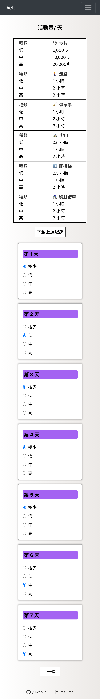
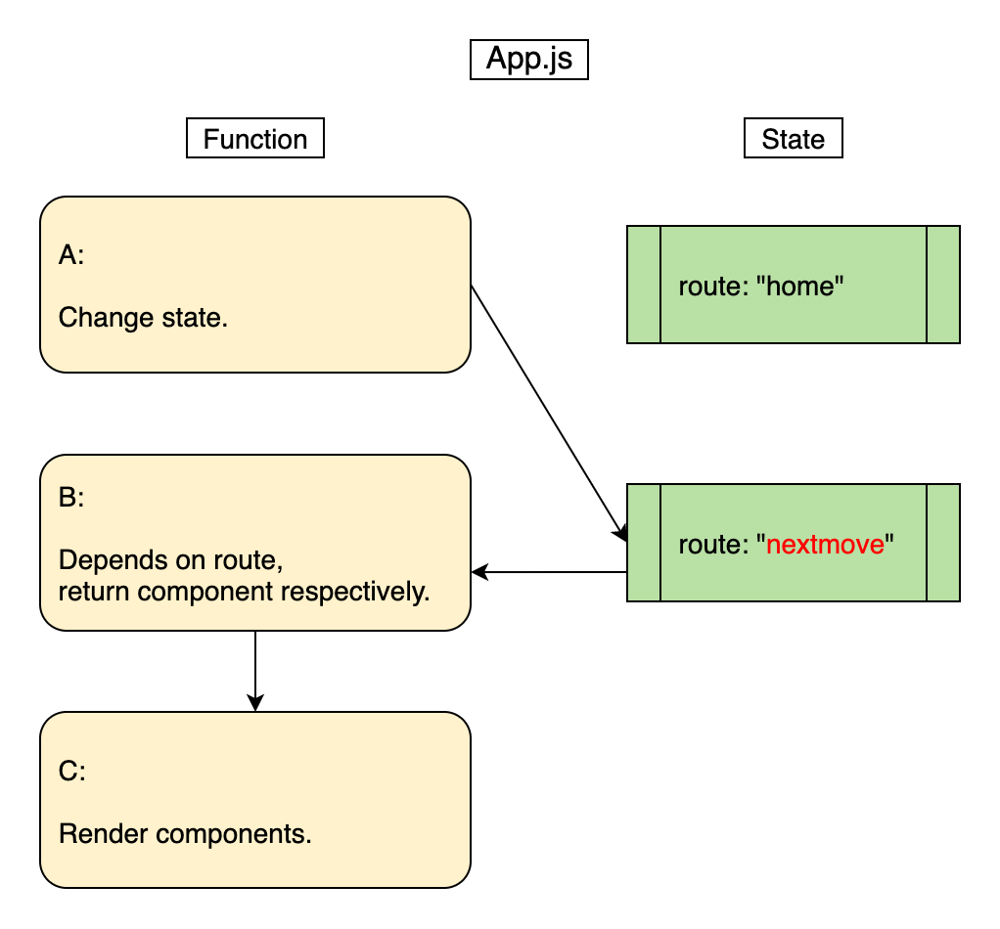
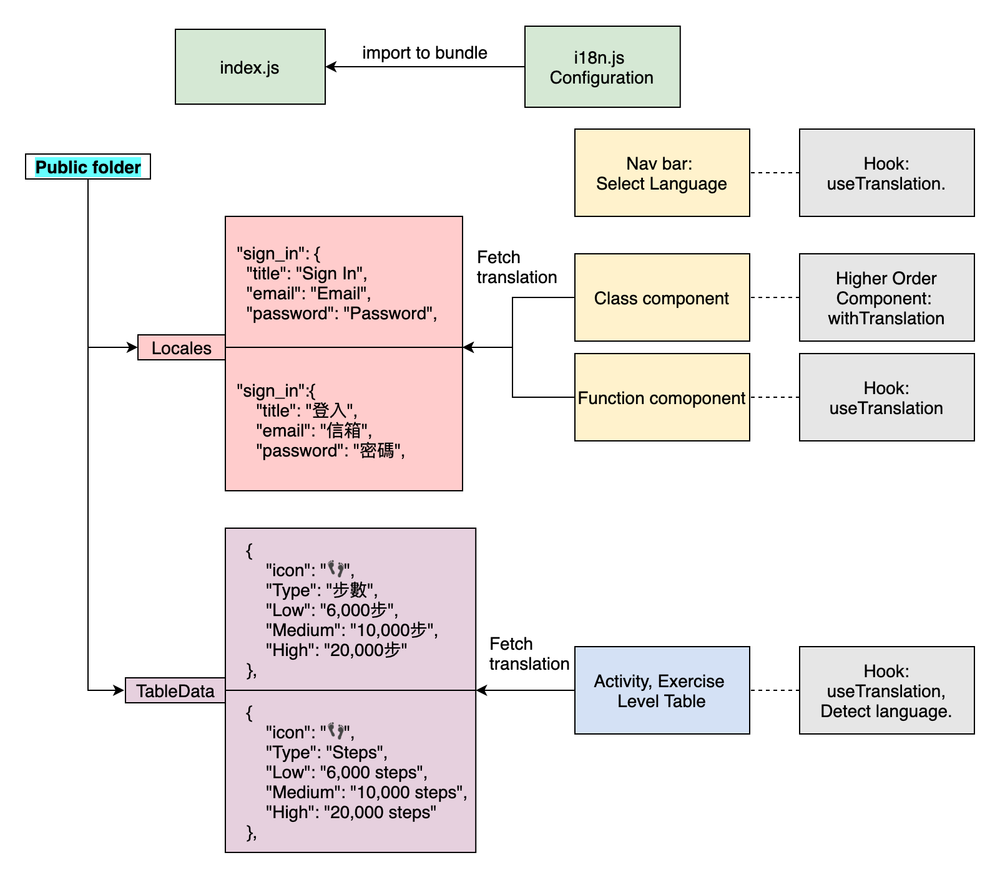

# Dieta - 減重熱量計算系統

### [README in English](https://github.com/yuwen-c/dieta/blob/master/README.md)
### 🔆 [實際操作網站](https://yuwen-dieta.netlify.app/)
### [後端server的github](https://github.com/yuwen-c/dieta-api)


## 動機及目的
- 想減重😁。採用的方式是：讓「攝取」的熱量比「消耗」的熱量少。
- 減重期間共約15週，每週都要重複計算熱量、做調整，我希望有一個系統，不只幫助計算，也記得上週的數據，方便做調整，讓減重更輕鬆。

## 功能路徑、使用方式簡介

<div align="center">
  
  <br>
</div>

- Dieta 主要有3條路徑/ 功能 (圖中黃色方框)：
1. 第一週，開始減脂：使用者輸入體重、預計熱量赤字，並且根據指示，選擇活動量、運動量等級，得到營養素及熱量的計算結果。
2. 第二週以後：輸入本週、上週平均體重，獲得建議，來決定下一週的調整方向(少吃或多吃)，然後一樣填入活動量、運動量，得到熱量計算結果。
3. 此外，隨時可以到「結果查詢」叫出上次的計算結果。


## 實際上線成果🚀
- 我把這個project介紹給我的教練，他覺得很好用，也推薦給他的學生使用🥰。
- 上線一個月內達到 **31** 名使用者。

## 特點

### 整體架構
✨ 前端網站使用**React.js**。\
－語法類似Javascript，利用多個元件組合而成，元件各自獨立且可重複使用。\
✨ [後端server](https://github.com/yuwen-c/dieta-api)利用**node.js**, **express.js**。\
－使用Javascript語言，效能強大，可快速建造一個server。\
✨ 前後端以**RestfulAPI**連接。\
－提高可讀性、除錯效率，分離每個端點，可彈性組合成多種邏輯。\
✨ 使用者資料儲存於**PostgreSQL**資料庫。\
✨ 資料庫與server以**knex**相接。\
－說明文件清楚，功能強大。 

### 響應式網站
✨ 手機、桌機體驗良好的前端網站。\
✨ 利用```react-super-responsive-table```達成響應式表格。\
✨ 利用```react-bootstrap```達成響應式導覽列。\
✨ 利用```Tachyons```設定達成：針對不同螢幕大小，顯示不同樣式的設計。

### 安全性
✨ 使用者密碼以**Bcrypt**加密。\
✨ 使用者密碼，與姓名等資料分開存放在不同table，減少資料外洩的機率。

### 多國語言
✨ 支援中文/英文，採用```react-i18next```及```hooks```。\
－將翻譯檔放在後端，需要時再去抓取，減少檔案大小。\
－自動偵測使用者瀏覽器語言。\
－基於i18next的基礎上發展，而i18next可與多種框架配合使用，不僅限於react。

### 部署
✨ 前端網站部署到Netlify。\
－適合部署前端網站，不需等待喚醒時間。\
✨ 後端網站部署到Heroku。\
－維護、操作容易，適合小流量網站。

## 畫面預覽
- 首次使用，開始計算，輸入體重及預計熱量赤字。
<div align="center">
  
  <br>
</div>

- 根據表格資料，選擇當週的活動量等級。
<div align="center">
  
  <br>
</div>

- 電腦版的計算結果畫面，顯示使用者名稱、營養素、熱量。
<div align="center">
  
  <br>
</div>

- 進入第二週，輸入本週、上週平均體重，會根據減重速率，**動態顯示建議**，使用者再決定下週調整方向。
<div align="center">
  
  <br>
</div>

## 詳細作法

### 註冊、登入，及 Guest user試用登入
- 登入、註冊時，資料從前端帶到後端server，及資料庫，並回傳到前端：
  
<div align="center">
  
  <br>
</div>

- 登入(黃色框)時，資料傳到資料庫，比對hash的密碼，比對成功後將使用者資料回傳到前端。
- 註冊(藍色框)時，資料傳到後端，建立新使用者，並儲存hash密碼於Login table，另外也在Users table新增該使用者，過程以**transaction**完成。完成後，回傳資料到前端。
- Guest User(淺紫色框)的路線，則是不用註冊，直接試用計算熱量的功能，計算完成後，可導引至註冊頁面(箭頭連到註冊的藍色框)，填完資料後，系統會先新增該使用者，再將計算結果儲存到各個表格(箭頭旁的紫色說明文字部分)。


### 路徑一：「開始減脂」，儲存、計算營養素和熱量
- 「開始減脂」的路徑，前端畫面、state狀態、後端，與資料庫的流程圖示：

<div align="center">
  
  <br>
</div>

- 使用者輸入的資料，以及計算結果，都會存在state，最後一步才會透過server存到資料庫。

### 路徑二：第二週開始，「減脂期間」，調整熱量
- 「減脂期間」，使用者輸入體重後，動態檢視建議，並調整下週熱量。以下是使用者操作流程，及state改變：

<div align="center">
  
  <br>
</div>

- 輸入體重後計算速率，並觸發state改變，來達到顯示特定內容的功能。
- 使用者可選擇加快或放慢，畫面也會隨state跟著改變。

#### 畫面展示：
1. 輸入體重後，動態顯示建議。
2. 下方會隨著使用者選擇加快或放慢，動態顯示選項。

<div align="center">
  
  <br>
</div>


### 「下載上週記錄」功能，使用者不用再一一點選活動量、運動量。
- 當使用者進入減脂期間，到點選活動量、運動量頁面時，可點選下載按鈕，直接叫出上週的紀錄。下圖是使用者操作流程，及state改變，與後端、資料庫的流程：

<div align="center">
  
  <br>
</div>

- 原本為了將一週七天的選擇結果記錄下來，state裡面有設計活動量及運動量的陣列。
- 為了達到「將結果叫出，並且顯示在畫面上」的功能，我加上新的state去控制該選項是否「checked」。每一天的選項共有「無、低、中、高」四種等級，於是以一個2維陣列代表，分別紀錄每個小選項的checked狀態，checked為true的就會顯示為選中，```[false, true, false, false]``` 表示選中「低」。


### 路徑三：「叫出上次的熱量計算結果」
- 叫出計算結果，並顯示在畫面上。

<div align="center">
  
  <br>
</div>

- 此路徑必須先判斷是否為guest user，及是否存有記錄(已註冊，但還沒計算過的使用者，就不會有紀錄)。如果有，在畫面上顯示結果；沒有，顯示提醒，並將使用者導引至路徑一：熱量計算。

### 使用三大路徑功能(開始計算、熱量調整、查看上次熱量紀錄)時，判斷權限。
- 區分使用者是否有登入，某些功能頁面僅限已登入的使用者使用，未登入者會被導引至登入畫面。
- 除此之外，進入不同功能時，有些前置作業(抓資料、刪除資料)必須完成，也是在這邊做判斷並執行。

<div align="center">
  
  <br>
</div>


### 進入下一頁的檢查
- 在頁面跳轉時，執行檢查，確認空格皆有填寫、符合格式，或是該使用者先前有留過資料，才能進入下一頁。
- 各頁面的檢查以```switch case```分別定義。
- 以「進入選擇活動量頁面」為例：

<div align="center">
  
  <br>
</div>

- 使用者想進入選擇活動量頁面
1. 先判斷使用者是從「路徑一，計算熱量」還是「路徑二，熱量調整」來的？
2. 再判斷各自的頁面資料是否填寫正確。如錯誤，顯示提醒；正確，路徑一者，導引到活動頁；路徑二，再次進行判斷，是否已有計算資料？沒有的話，彈出提醒。

### 根據route顯示不同畫面
- ```App.js```裡用function及state來控制畫面：
<div align="center">
  
  <br>
</div>

- 設定3個function，及一個route state。
- ```A function```專門change State。
- ```B function```傳入route state，並以```switch case```分別定義：在不同route case時，回傳要顯示的component。
- ```C render function```放入```B function```的執行結果。


### 利用portal做出彈出提醒視窗Modal
- 以```portal```功能達到modal效果。下圖顯示使用者操作流程，搭配component的資料傳遞。

<div align="center">
  
  <br>
</div>

- 遇到「未完成第一次計算」的使用者想下載紀錄，跳出錯誤宣告:「沒有計算結果」或「沒有活動量、運動量紀錄」
- 分別設定單獨的modal component，及另外一個內容component，將內容以children的方式傳入modal，達到重複利用component的目的。

### react-i18next 設定多國語言 - internationalization

<div align="center">
  
  <br>
</div>

- 設定```i18n.js```檔，用來設定語言、偵測器、後端下載的路徑，並import到```index.js```使他能被bundle在一起。
- 翻譯的json檔，主要放在```public``` > ```locales``` 檔案夾。
- 幾種使用react-i18next的方式：
1. 導覽列的語言切換功能: 使用useTranslation Hook.
2. functional component: 使用useTranslation Hook.
3. class component: 使用withTranslation, Higher order component.
4. 另外，運動、活動表格裡的資料，不是寫死在表格裡，而是匯入檔案，把資料倒進去。所以我把翻譯檔另外放，要用時，先偵測語言，再去public folder fetch回來。


